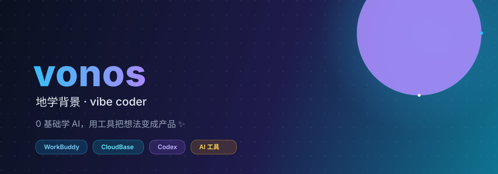

<!-- 顶部 banner -->

  

<h1 align="center">你好，我是 vonos（刘灿）</h1>

  <b>地理 × AI 跨界者</b> · 把 AI 工具变成普通人的超能力

  
  
  

---

## 🧭 我是谁

- 🎓 **武汉大学** 在读研究生，方向 **地理科学 × 人工智能**，发过 *Nature Plants* 一作/共同一作论文
- ✍️ **内容创作者**：公众号 / 小红书「普通人玩转 AI 的一百种方法」，累计阅读 7w+
- 🛠️ **独立开发者**：用 AI 工具链从 0 到 1 做出真实可用的产品（不是 Demo）
- 🌱 **2026 关键词**：`账号` · `身体` · `科研`

> 我擅长发现被忽视的角落，把复杂的 AI 能力翻译成普通人能上手的东西。

---

## 🛠 技术栈 & 工具

  

| 领域 | 常用 |
|------|------|
| 开发 | React · TypeScript · Vite · CloudBase 云开发 · Recharts |
| 数据 / AI | Python · 数据可视化 · 大模型 Prompt · AI 视频 / 生图 |
| 内容 | 公众号排版 · 小红书 · 科普写作 · 全 AI 视频制作 |
| 研究 | 文献追踪 · 科研科普 · 量化 Alpha（WorldQuant BRAIN）|

---

## 🚀 精选项目

| 项目 | 简介 | 技术 |
|------|------|------|
| [**实习能量站**](https://github.com/vonos/intern-energy-station) | 业务部新人成长导航智能看板，三角色（实习生/导师/HR）× 三纵四横成长框架，含任务审核流 | React · CloudBase |
| [**HomeDraw**](https://github.com/vonos/HomeDraw) | 我的个人作品之一 | — |
| [**animate-your-word**](https://github.com/vonos/animate-your-word) | 有趣的文字动画小工具 | — |
| [**个人主页**](https://vonos.github.io) | 基于 GitHub Pages 搭建 | HTML/CSS/JS |

> 💡 更多在 [Repositories](https://github.com/vonos?tab=repositories) 里，欢迎 Star & Fork。

---

## 📊 数据看板

  
  

  

---

## 🐍 贡献轨迹

  

---

## 🌟 最近在做 / 在学

- 🎬 **AI 视频**：用 ComfyUI / WorkBuddy 做全 AI 生成视频（零外部素材、零剪辑软件）
- 📈 **量化探索**：WorldQuant BRAIN 有条件顾问，搭建 RAG 知识库 + MCP 工具链挖 Alpha
- 📚 **科普写作**：把「叶片温度 60 年研究史」这类硬核科研拆成普通人爱看的故事
- 🖨️ **个人项目**：微信读书高亮导出 → 自动排版打印成册

---

## 📡 找到我

  
  

> 公众号 / 小红书搜索「**普通人玩转 AI 的一百种方法**」就能找到我 👋

---

  <i>⚡ 本主页使用 WorkBuddy + Auto 模型设计与构建</i>

